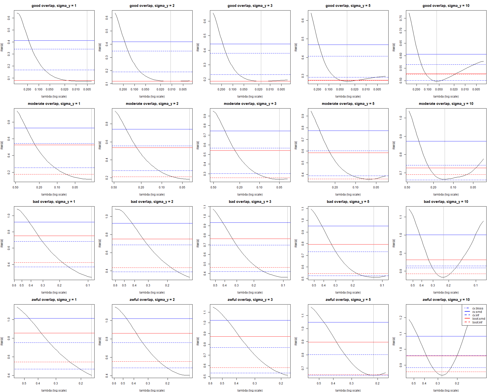
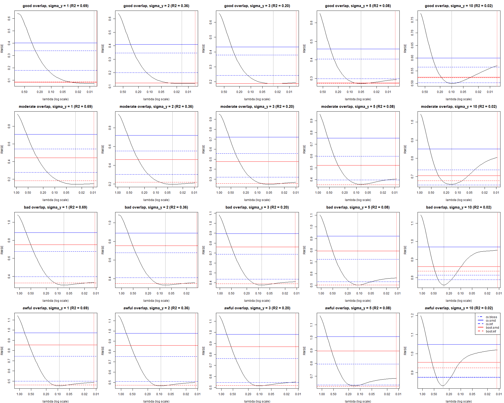
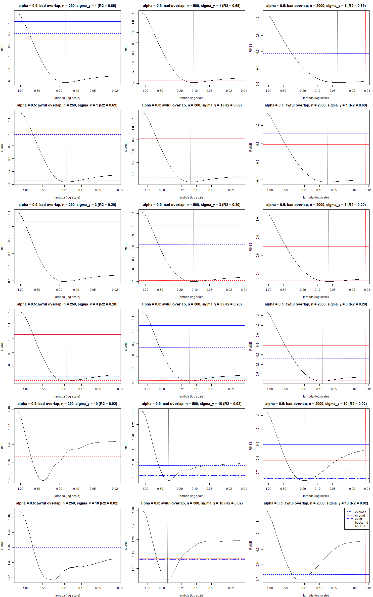
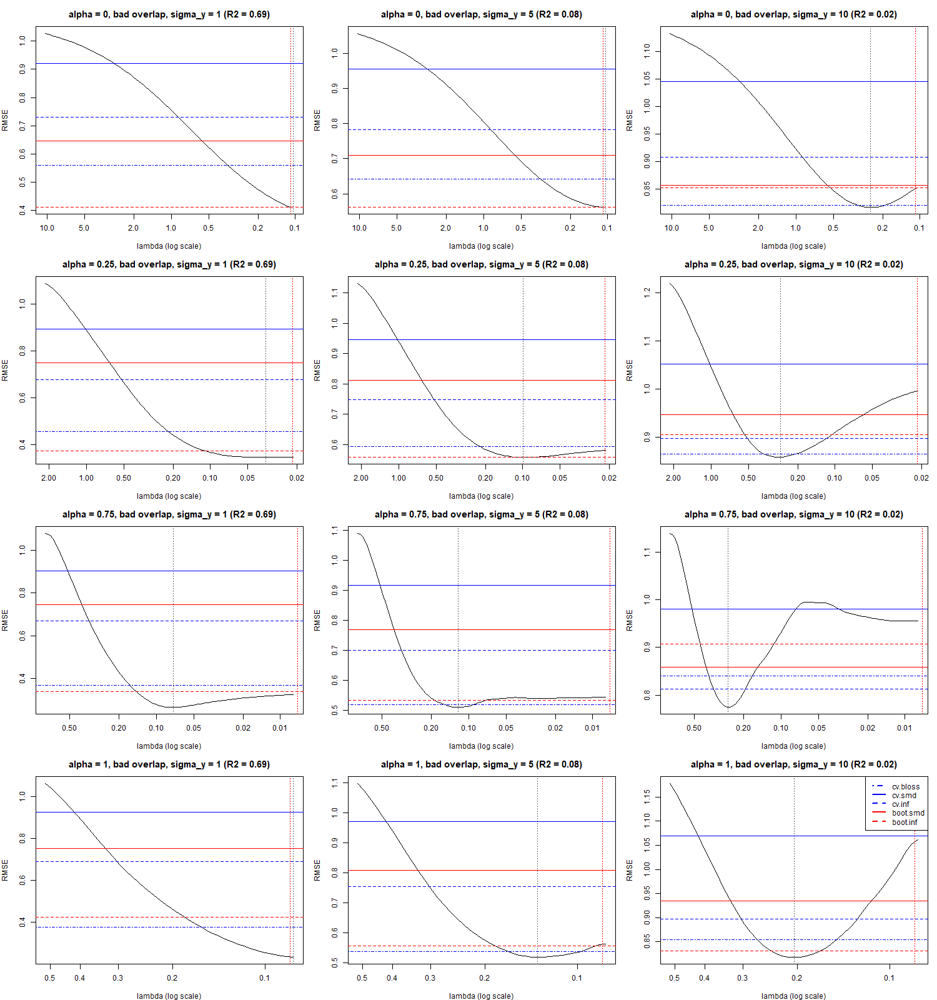
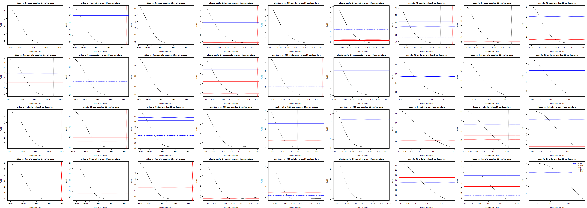
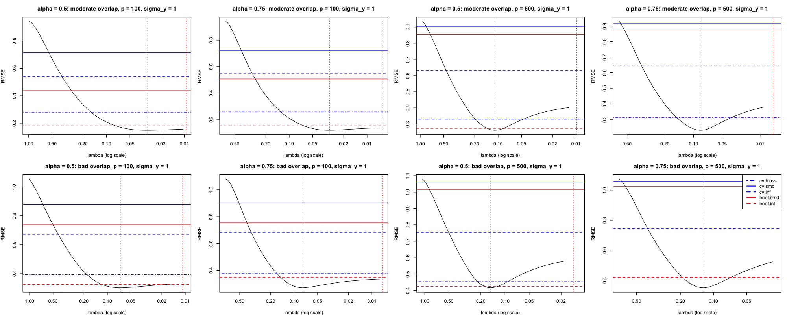
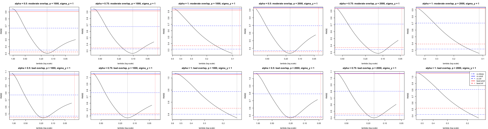
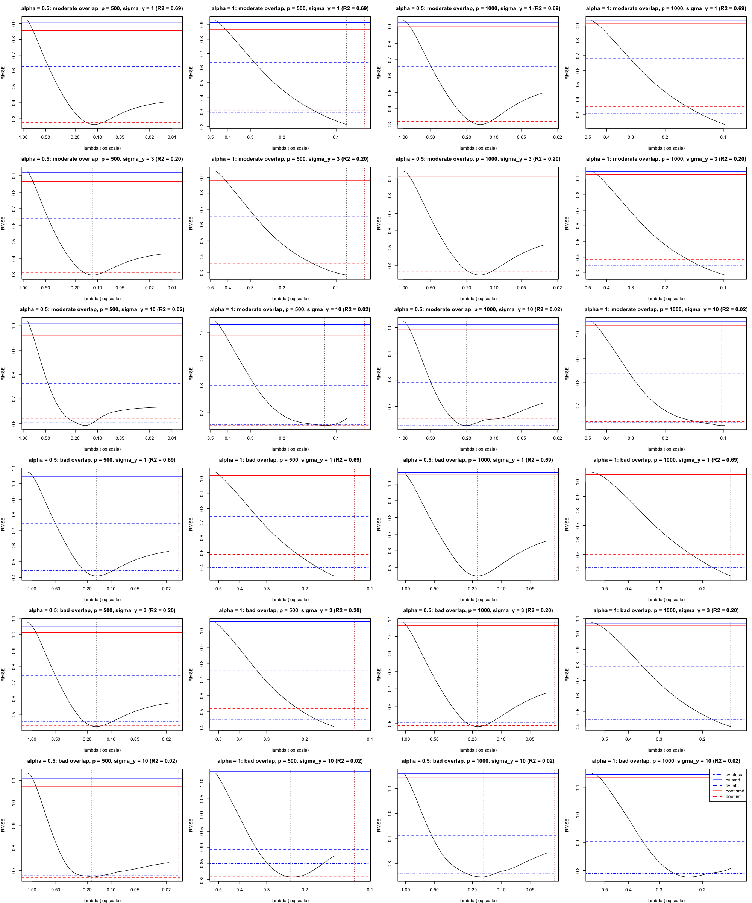

```{r}
library(dplyr)
library(knitr)
tab <- readr::read_csv("cv_summary.csv")
counts <- readr::read_csv("cv_family_counts.csv")
vs_lasso <- readr::read_csv("cv_vs_lasso_floor.csv")
```

## Objective

Two questions about balnet's penalty path for the treated-arm mean $\mu_1 = E[Y(1)]$: where along the path is \$\lambda = \$ floor not RMSE-optimal, and do the five balance-based selectors (cv.balnet with balance loss, mean SMD, max SMD; cv.boot.balnet with mean SMD, max SMD) ever beat the floor. Everything here is exploratory; cells have 200 or 500 replications, so relative MCSE of an RMSE is about 5% or 3%.

## Design

Covariates are AR(1) with $\rho = 0.5$, $p = 100$ unless varied. Five confounders (coefficient $1/\sqrt{5}$ in both propensity and outcome) unless confounder spread $s$ is varied. Overlap is set by the propensity scale, SD$(\eta) \approx$ 1.0, 2.2, 3.7, 6.0 for good, moderate, bad, awful. Outcome $Y = X\beta + \sigma_y \varepsilon$ with $\sigma_y \in \{1, 2, 3, 5, 10\}$, i.e. $R^2 \approx$ 0.69, 0.36, 0.20, 0.08, 0.02; where several $\sigma_y$ share one set of fits the same $\varepsilon$ is used, so comparisons across SNR are paired. Penalties: lasso ($\alpha = 1$), elastic net ($\alpha = 0.5$, also 0.25, 0.75), ridge ($\alpha = 0$). The floor is the smallest $\lambda$ reached by at least 95% of replicates; for lasso under weak overlap or $p \ge n_1$ this is where the solver hits its iteration cap, not $\lambda \to 0$. Metric: RMSE over replications, with a paired test on squared errors for selector versus floor ($|z| > 2$).

## The map

{width="100%"}

{width="100%"}

{width="90%"}

{width="90%"}

{width="100%"}

{width="100%"}

{width="100%"}

{width="90%"}

## Counted results

```{r}
counts |>
  select(design, alpha, cells, interior, bootinf_wins, cvbloss_wins,
         any_sel_win, floor_wins) |>
  kable(caption = "Per family: cells with an interior optimum (floor more than 5% above the minimum) and selector wins or floor wins at |z| > 2.")
```

```{r}
vs_lasso |>
  mutate(across(c(lasso_floor, best_sel, ratio), \(v) round(v, 3))) |>
  kable(caption = "Best elastic-net or ridge selector against the lasso floor for the same design. Ratio below 1: the selector beats the lasso floor.")
```

## Findings

The RMSE along the path decomposes into a bias term from residual imbalance, which falls as $\lambda$ falls, and a noise term $\sigma_y^2 \sum_i w_i(\lambda)^2 / n^2$, which rises as weights become extreme. An interior optimum therefore appears when outcome noise is large relative to confounding signal, when overlap is weak, or when $p$ approaches $n_1$. With five strong confounders, $p = 100$ and $R^2 \ge 0.36$, the floor is optimal at good and moderate overlap and within 10% of optimal at bad and awful.

All five selectors are outcome-blind, so the $\lambda$ they choose does not move with $\sigma_y$ while the optimum does. Each selector is a fixed rung; a selector "wins" a cell when the optimum has moved onto its rung. boot.inf sits nearest the optimum for $R^2 \ge 0.08$, cv.bloss for $R^2 \approx 0.02$. The mean-SMD criteria choose $\lambda_{\max}$ (no weighting) whenever $p \ge 500$ and are never competitive.

Against the lasso floor the verdict is: selectors win only where $R^2 \lesssim 0.1$ or overlap is very weak, by 4–8% at $R^2 = 0.08$ and 13–31% at $R^2 = 0.02$, and that advantage grows with $n$ under weak overlap. At $R^2 \ge 0.36$ the lasso floor wins by 15–57%, by a margin that grows with $n$, with $p$ and with confounder spread. At $p \ge 500$ the lasso floor beats every elastic-net selector at $R^2 \ge 0.2$; at $R^2 = 0.02$ selectors win by 7–23% at $p = 500$ and the gap closes at $p = 1000$.

The penalty does not change the achievable minimum at $p = 100$; it changes path reach (lasso stops early; elastic net and ridge run to the exact-balance plateau) and which rung each selector lands on. At $p \ge n_1$ sparser penalties reach lower minima at high SNR, and the lasso stop lands at the best point in every high-SNR cell.

## Caveats

Single arm ($\mu_1$); a linear, correctly specified outcome and a logistic-linear propensity, so the $\lambda \to 0$ weights converge to the true inverse propensities where a minimiser exists. Lasso's floor is a compute budget (`maxit`), not a property of the estimator; raising it tenfold moved the floor a third of a decade at eight times the cost. Ridge's default floor ($\lambda_{\max}/100$) stops before its plateau at $\sigma_y = 1$. Where a replicate's path stopped early, `balweights()` clamps to its last $\lambda$; curves are drawn only where at least 95% of replicates reached that $\lambda$.
