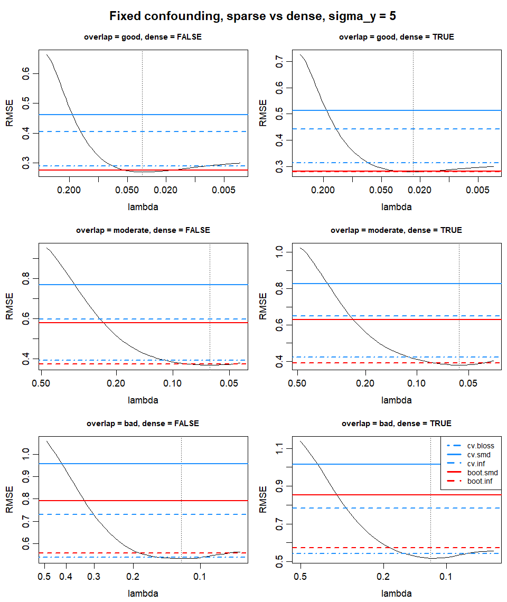
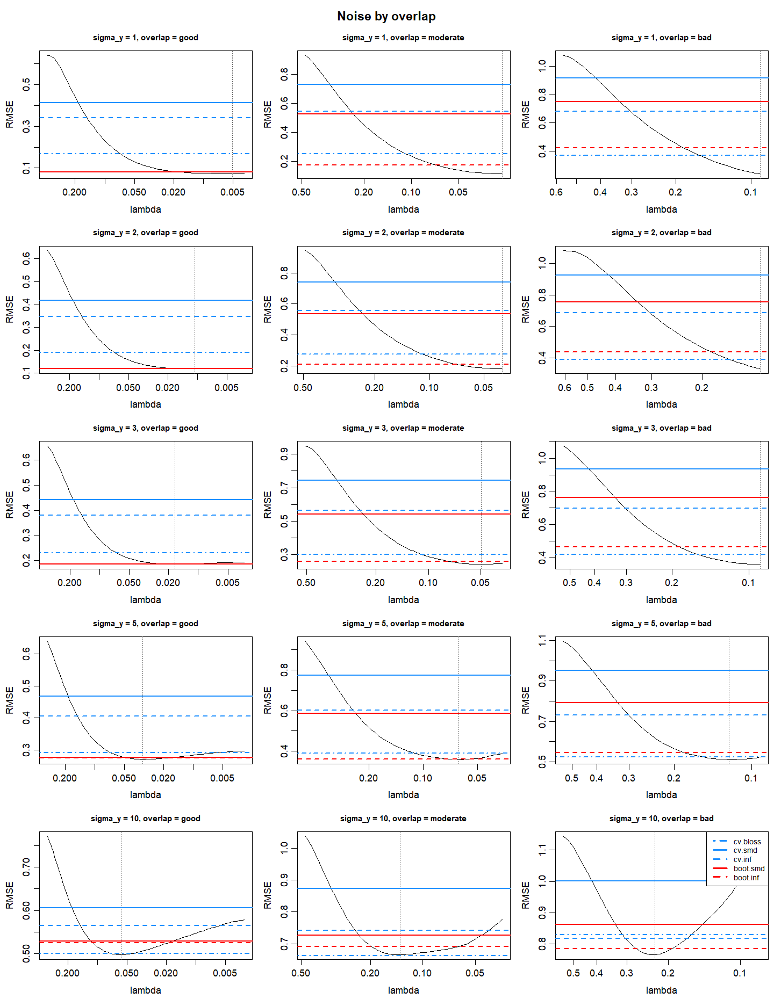
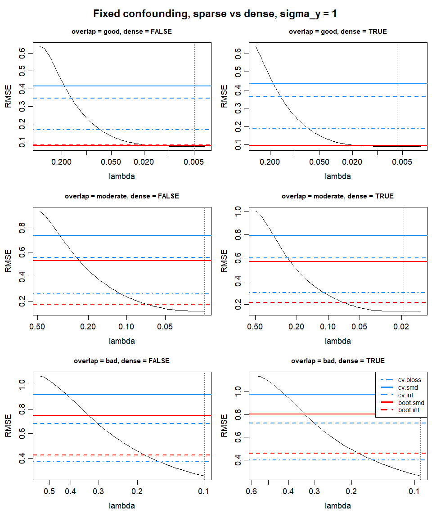
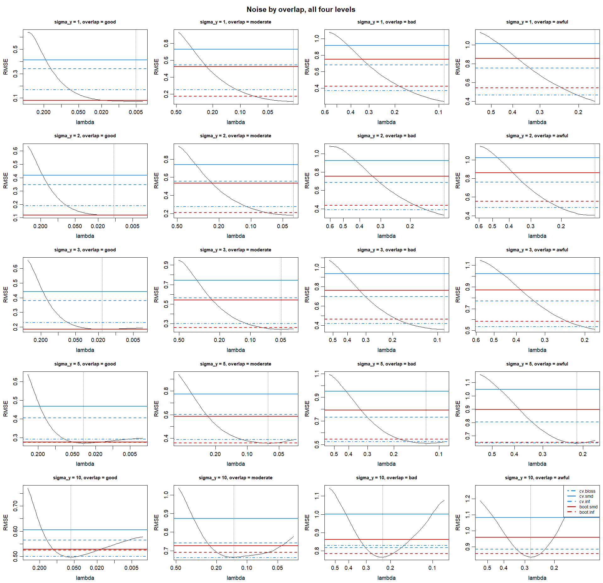

```{r setup}
library(readr)
library(dplyr)
library(ggplot2)
dir <- "C:/Users/otisr/Documents/Thesis 2026/Masters_Thesis/Exploring CV"
ov_lev <- c("good", "moderate", "bad", "awful")
sel_lab <- c(cv.bloss = "CV bal.loss", cv.smd = "CV mean SMD",
             cv.inf = "CV max SMD", boot.smd = "boot mean SMD",
             boot.inf = "boot max SMD")
tab <- read_csv(file.path(dir, "cv_summary.csv")) |>
  mutate(overlap = factor(overlap, ov_lev),
         r2_lab = factor(sprintf("%.2f", r2)),
         best_lab = sel_lab[best])
counts <- read_csv(file.path(dir, "cv_family_counts.csv"))
vs_lasso <- read_csv(file.path(dir, "cv_vs_lasso_floor.csv")) |>
  mutate(overlap = factor(overlap, ov_lev),
         r2_lab = factor(sprintf("%.2f", 2.23 / (2.23 + sigma_y^2))))
```

# Investigation

2 aims:

**A:** Is the optimal (minimizes RMSE) $\lambda$ interior, i.e. not the path floor $\lambda_{\min}$?\
**B:** If so, does any selector beat the path floor?

**notes:**

- *Path floor* $\lambda_{\min}$ *is balnet default,* $\lambda_{\max}/100$*, stated if changed.*
- *Sampling noise: 500 reps, relative MCSE 3% (Morris et al, 2019).*
- *Default penalty* $\alpha = 1$*, lasso regularisation (stated if changed).*

# Outcome Noise, Density, and Overlap

## Sparse outcome

- 5 active confounders (`s_y = 5`).
- `sigma_y` increases outcome noise (reduces $R^2$, lowers SNR).
- `c_prop` $\in \{0.7, 1.5, 2.5\}$ for `overlap` good $>$ moderate $>$ bad: degrades overlap.

{width="100%"}

**A:** with `sigma_y = 5`, interior solutions exist at all 3 overlap levels.

**B:** With large outcome noise, selectors outperform the path floor $\lambda_{\min}$ at good and moderate overlap; at bad overlap the best selector only ties it.

- good overlap: `boot.smd` $\approx$ `boot.inf` \> `cv.bloss` \> path floor $\lambda_{\min}$

- moderate overlap: `boot.inf` \> `cv.bloss` \> path floor $\lambda_{\min}$

- bad overlap: `cv.bloss` $\approx$ path floor $\lambda_{\min}$

**Increasing outcome noise causes both interior optimums and selector wins.**

**Criterion selection:** Degrading overlap increases the relative performance of the path floor $\lambda_{\min}$. It also changes the ranking between selection criteria (`boot.smd` collapses beyond good overlap, `boot.inf` holds, `cv.bloss` improves relative to both SMD criteria).

**Bootstrapping vs cross-validation:** for both criteria where the two are available (`smd`, `inf`), bootstrapping outperforms CV at every overlap level. `cv.bloss` is the only competitive criterion under bad overlap, and has no bootstrapped equivalent.

*Note: sampling error affects ranking (Appendix 2). Same DGP, same reps: at bad overlap, `sigma_y = 5`, `cv.bloss` now edges the path floor and `boot.inf` ties it.*

## Dense outcome: fixed confounding

DGP isolates the effect of outcome density by holding confounder signal fixed:

- 50 active outcome covariates:
  - 5 confounders at `1/sqrt(5)`
  - 45 outcome-only predictors at `1/sqrt(45)`

Appendix 1 shows a diluted case where `beta_y[1:s_y] <- 1/sqrt(s_y)` makes increasing density also decrease confounder signal (in effect, increasing `sigma_y`).

{width="100%"}

Under both high and low noise settings *(Appendix 3)* outcome density does not appear to drive selection performance, or interior minimums. Results for density show only minor changes to relative performance, with any ranking differences likely sampling noise.

## Investigating noise

{width="100%"}

**A:** interior minimums appear at lower noise under strong overlap; as overlap degrades, more noise is needed.

- good overlap: interior at $\sigma_y = 3$ (possibly 2, a draw by eye)
- moderate overlap: interior from $\sigma_y = 3$ (faint at 3, clear at 5)
- bad overlap: interior at $\sigma_y = 5$

**B:** Selectors beat the path floor $\lambda_{\min}$ once the interior is clear. Best selector changes with noise and overlap.

- good overlap:
  - $\sigma_y = 2$: path floor $\lambda_{\min}$ $\approx$ `boot.inf` $\approx$ `boot.smd` *(draw)*
  - $\sigma_y = 3$: `boot.inf` $\approx$ `boot.smd` \> path floor $\lambda_{\min}$
  - $\sigma_y = 5$: `boot.inf` $\approx$ `boot.smd` \> `cv.bloss` $\approx$ path floor $\lambda_{\min}$
  - $\sigma_y = 10$: `cv.bloss` \> `boot.inf` $\approx$ `boot.smd` \> `cv.inf` $\approx$ path floor $\lambda_{\min}$
- moderate overlap:
  - $\sigma_y = 5$: `boot.inf` \> `cv.bloss` $\approx$ path floor $\lambda_{\min}$
  - $\sigma_y = 10$: `cv.bloss` \> `boot.inf` \> `boot.smd` $\approx$ `cv.inf` \> path floor $\lambda_{\min}$
- bad overlap:
  - $\sigma_y = 5$: `cv.bloss` $\approx$ path floor $\lambda_{\min}$ (draw)
  - $\sigma_y = 10$: `boot.inf` \> `cv.bloss` $\approx$ `cv.inf` \> `boot.smd` \> path floor $\lambda_{\min}$

**Interior minimums:** Interior minimums depend on both noise and overlap. $\lambda_{\min}$ is more robust to degredation in overlap, while the CV/BS selectors that are competitive, are generally more robust to increased outcome noise.

**Criterion selection:** `cv.bloss` and `boot.inf` are the most effective criteria. `cv.bloss` is more robust to overlap degradation, outperforming `boot.inf` under "bad" overlap for $\sigma_y \le 5$ and underperforming for "good" and "moderate" overlap.r

This pattern inverses at $\sigma_y = 10$, where the order flips with `cv.bloss` \> `boot.inf` for good and moderate overlap, and `cv.bloss` \< `boot.inf` for bad overlap. **Why?**

- maybe overlap causes the $\lambda$ selector to stop earlier, and noise increases the optimal $\lambda$. At low noise the deeper selector wins and at high noise the earlier one does, so the winner flips with noise, and since overlap sets which selector is the earlier one, it flips with overlap too.

# Penalty

## Alpha sweep at bad overlap

Varies: alpha (0, 0.25, 0.75, 1) by sigma_y (1, 5, 10) on shared fits. Fixed: bad overlap, baseline otherwise. Alpha 0.5 is the bad row of the elastic net section. Lasso row uses maxit 1e5.

{width="100%"}

## Ridge and elastic net at the default floor

Varies: overlap (all four) by alpha (0, 0.5). Fixed: sigma_y = 1, sparse outcome. Path ends at the package default, lambda max over 100.

{width="100%"}

## Ridge and elastic net with the path extended to 1e-4

Same grid, path floor lowered to 1e-4. Pair with the previous figure.

{width="100%"}

# Sample size

## Lasso, sigma_y = 1

Varies: overlap by n (250, 2000, 5000). Fixed: baseline, lasso. Strong overlap then weak overlap.

{width="100%"}

{width="100%"}

## Lasso, sigma_y = 3

{width="100%"}

{width="100%"}

## Lasso, sigma_y = 10

{width="100%"}

{width="100%"}

## Elastic net, weak overlap

Varies: sigma_y (1, 3, 10, shared fits) by n (250, 500, 2000). Fixed: alpha 0.5, p = 100. Bad overlap then awful.

{width="100%"}

{width="100%"}

# Dimension

## p in 100, 500, elastic net

Varies: overlap (moderate, bad) by p. Fixed: alpha 0.5, sigma_y = 1, n = 1000.

{width="100%"}

## p = 1000, elastic net and lasso

Varies: overlap (moderate, bad) by alpha (0.5, 1). Fixed: p = 1000, sigma_y = 1, n = 1000.

{width="100%"}

## p = 2000, elastic net and lasso

{width="100%"}

## SNR at high p, moderate overlap

Varies: sigma_y (1, 3, 10) by alpha (0.5, 1). Fixed: n = 1000. p = 500 then p = 1000.

{width="100%"}

{width="100%"}

## SNR at high p, bad overlap

{width="100%"}

{width="100%"}

# Confounder spread

## Lasso

Varies: overlap (all four) by number of confounders s (5, 20, 50), coefficient 1/sqrt(s) in propensity and outcome. Fixed: sigma_y = 1, p = 100, n = 1000.

{width="100%"}

## Elastic net, alpha 0.5

{width="100%"}

## Ridge, alpha 0

{width="100%"}

# Selector ranking

# Against the lasso floor

# Caveats

# Appendix

## Appendix 1: Dense outcome, diluted confounding

- 100 active outcome covariates (`s_y = 100`), 5 confounders.
- **Confounder signal is diluted:** `beta_y[1:s_y] <- 1/sqrt(s_y)` shrinks every outcome coefficient as `s_y` grows, including the 5 confounders.
  - Increasing density decreases confounder signal, in effect lowering the confounders' share of outcome variance, which `sigma_y` already does.

{width="100%"}

## Appendix 2: Sparse outcome replicate

Same DGP and reps as the sparse figure in Section 2, independent draws.

{width="100%"}

## Appendix 3: Sparse vs dense, sigma_y = 1

{width="100%"}

## Appendix 4: Noise by overlap, including awful

{width="100%"}
