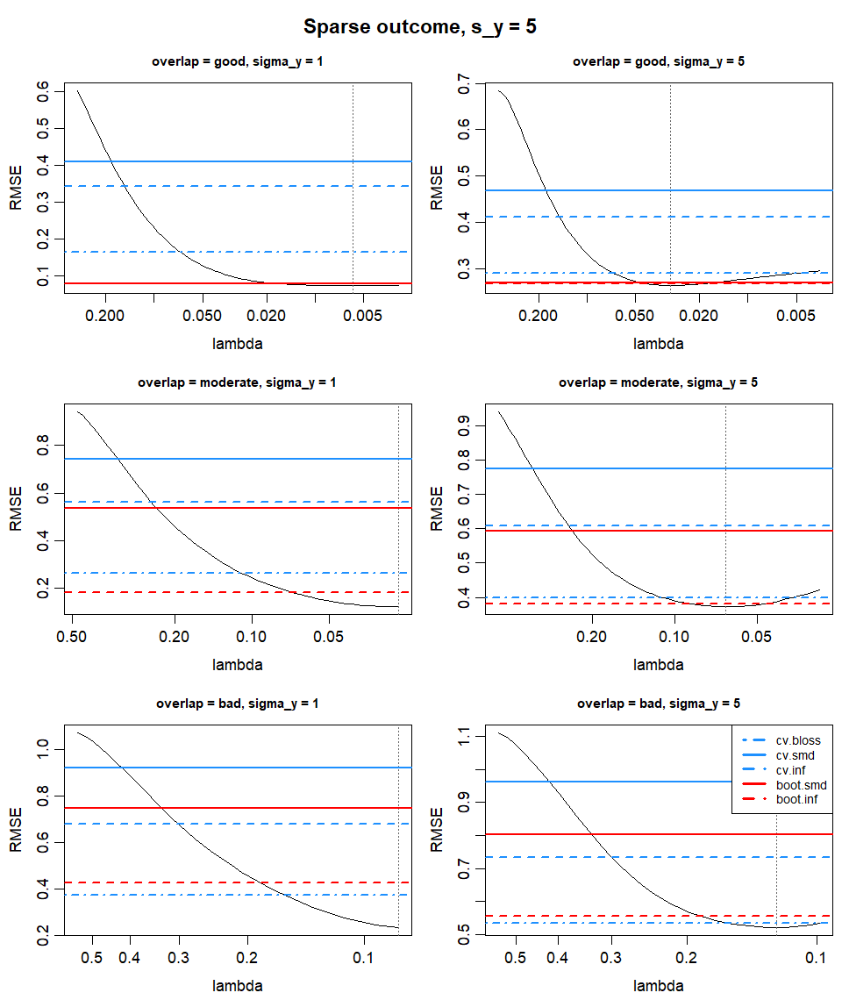
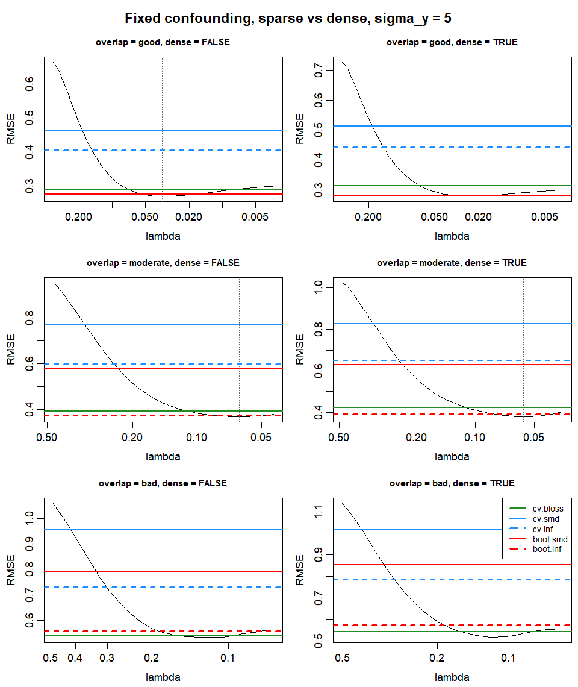
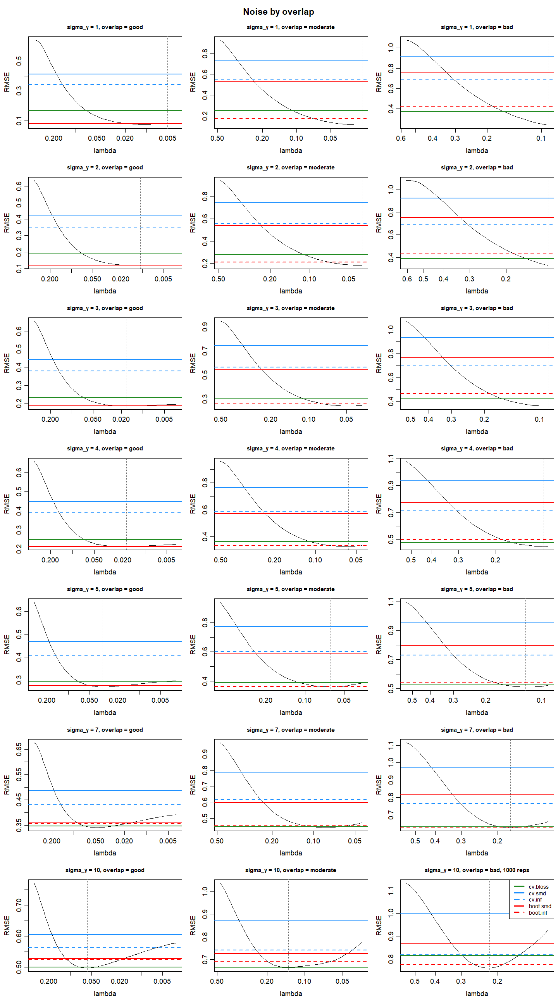
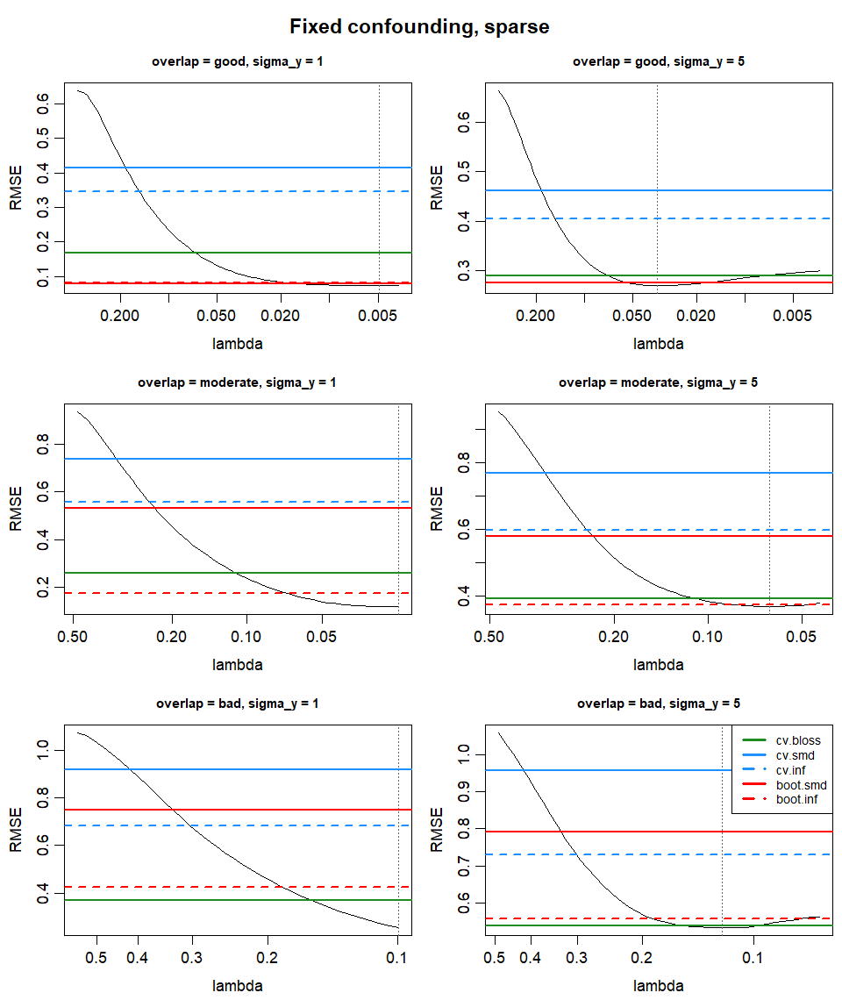

```{r setup}
library(readr)
library(dplyr)
library(ggplot2)
dir <- here::here("output", "cv", "basic_dgp", "summaries")
ov_lev <- c("good", "moderate", "bad", "awful")
sel_lab <- c(cv.bloss = "CV bal.loss", cv.smd = "CV mean SMD",
             cv.inf = "CV max SMD", boot.smd = "boot mean SMD",
             boot.inf = "boot max SMD")
tab <- read_csv(file.path(dir, "cv_summary.csv")) |>
  mutate(overlap = factor(overlap, ov_lev),
         r2_lab = factor(sprintf("%.2f", r2)),
         best_lab = sel_lab[best])
counts <- read_csv(file.path(dir, "cv_family_counts.csv"))
vs_lasso <- read_csv(file.path(dir, "cv_vs_lasso_floor.csv")) |>
  mutate(overlap = factor(overlap, ov_lev),
         r2_lab = factor(sprintf("%.2f", 2.23 / (2.23 + sigma_y^2))))
```

# Investigation

2 aims:

**A:** Is the optimal (minimizes RMSE) $\lambda$ interior, i.e. not the path floor $\lambda_{\min}$?\
**B:** If so, does any selector beat the path floor?

**Target criterion**

All selectors use `X` and `W` only and return `lambda.min`, the path value minimising their criterion on held-out units (treated arm):

- `bloss`: balance loss $\frac{1}{n}\sum_i [W_i e^{-\eta_i} +
  (1 - W_i)\eta_i]$, the balnet objective (Tan, 2020).
- `smd`: mean $|\mathrm{SMD}_j|$, IPW-weighted treated mean against the full-sample mean, in full-sample SDs.
- `inf`: max $|\mathrm{SMD}_j|$.

**CV vs bootstrap**

- CV (`cv.balnet`, 10 folds): refit on the training folds, criterion on the held-out fold, averaged over folds.
- Bootstrap (`cv.boot.balnet`, 500 half-samples): no refitting; the full-sample weights are scored on random half-samples against the full-sample means and SDs (Wang and Zubizarreta, 2020).

**notes:**

- *Path floor* $\lambda_{\min}$ *is balnet default,* $\lambda_{\max}/100$*, stated if changed.*
- *Sampling noise: 500 reps, relative MCSE 3% (Morris et al, 2019).*
- *Default penalty* $\alpha = 1$*, lasso regularisation (stated if changed).*

# Outcome Noise and Overlap

## Sparse outcome

- 5 active confounders (`s_y = 5`).
- `sigma_y` increases outcome noise (reduces $R^2$, lowers SNR).
- `c_prop` $\in \{0.7, 1.5, 2.5\}$ for `overlap` good $>$ moderate $>$ bad: degrades overlap.

{width="100%"}

**A:** with `sigma_y = 5`, interior solutions exist at all 3 overlap levels.

**B:** With large outcome noise, selectors outperform the path floor $\lambda_{\min}$ at good and moderate overlap; at bad overlap the best selector only ties it.

- good overlap: `boot.smd` $\approx$ `boot.inf` \> `cv.bloss` \> path floor $\lambda_{\min}$

- moderate overlap: `boot.inf` \> `cv.bloss` \> path floor $\lambda_{\min}$

- bad overlap: `cv.bloss` $\approx$ path floor $\lambda_{\min}$

**Increasing outcome noise causes both interior optimums and selector wins.**

**Criterion selection:** Degrading overlap increases the relative performance of the path floor $\lambda_{\min}$. It also changes the ranking between selection criteria (`boot.smd` collapses beyond good overlap, `boot.inf` holds, `cv.bloss` improves relative to both SMD criteria).

**Bootstrapping vs cross-validation:** for both criteria where the two are available (`smd`, `inf`), bootstrapping outperforms CV at every overlap level. `cv.bloss` is the only competitive criterion under bad overlap, and has no bootstrapped equivalent.

*Note: sampling error affects ranking (Appendix 2). Same DGP, same reps: at bad overlap, `sigma_y = 5`, `cv.bloss` now edges the path floor and `boot.inf` ties it.*

## Dense outcome: fixed confounding

DGP isolates the effect of outcome density by holding confounder signal fixed:

- 50 active outcome covariates:
  - 5 confounders at `1/sqrt(5)`
  - 45 outcome-only predictors at `1/sqrt(45)`

Appendix 1 shows a diluted case where `beta_y[1:s_y] <- 1/sqrt(s_y)` makes increasing density also decrease confounder signal (in effect, increasing `sigma_y`).

{width="100%"}

Under both high and low noise settings *(Appendix 3)* outcome density does not appear to drive selection performance, or interior minimums. Results for density show only minor changes to relative performance, with any ranking differences likely sampling noise.

## Investigating noise X overlap.

{width="23.2in"}

*cell (5,3 - sigma 10 bad overlap at 1000 reps to confirm pattern change.*

**A:** interior minimums appear at lower noise under strong overlap; as overlap degrades, more noise is needed.

- good overlap: interior at $\sigma_y = 3$ (possibly 2, a draw by eye)
- moderate overlap: interior from $\sigma_y = 3$ (faint at 3, clear at 5)
- bad overlap: interior at $\sigma_y = 5$

**B:** Selectors beat the path floor $\lambda_{\min}$ once the interior is clear. Best selector changes with noise and overlap.

- good overlap:
  - $\sigma_y = 2$: path floor $\lambda_{\min}$ $\approx$ `boot.inf` $\approx$ `boot.smd` *(draw)*
  - $\sigma_y = 3$: `boot.inf` $\approx$ `boot.smd` \> path floor $\lambda_{\min}$
  - $\sigma_y = 5$: `boot.inf` $\approx$ `boot.smd` \> `cv.bloss` $\approx$ path floor $\lambda_{\min}$
  - $\sigma_y = 10$: `cv.bloss` \> `boot.inf` $\approx$ `boot.smd` \> `cv.inf` $\approx$ path floor $\lambda_{\min}$
- moderate overlap:
  - $\sigma_y = 5$: `boot.inf` \> `cv.bloss` $\approx$ path floor $\lambda_{\min}$
  - $\sigma_y = 10$: `cv.bloss` \> `boot.inf` \> `boot.smd` $\approx$ `cv.inf` \> path floor $\lambda_{\min}$
- bad overlap:
  - $\sigma_y = 5$: `cv.bloss` $\approx$ path floor $\lambda_{\min}$ (draw)
  - $\sigma_y = 10$: `boot.inf` \> `cv.bloss` $\approx$ `cv.inf` \> `boot.smd` \> path floor $\lambda_{\min}$

**Interior minimums:** Interior minimums depend on both noise and overlap. $\lambda_{\min}$ is more robust to degredation in overlap, while the CV/BS selectors that are competitive, are generally more robust to increased outcome noise.

**Criterion selection:** `cv.bloss` and `boot.inf` are the most effective criteria. `cv.bloss` is more robust to overlap degradation, outperforming `boot.inf` under "bad" overlap for $\sigma_y \le 5$ and underperforming for "good" and "moderate" overlap.

This pattern inverses between $\sigma_y = 7$ and $\sigma_y = 10$, where the order flips with `cv.bloss` \> `boot.inf` for good and moderate overlap, and `cv.bloss` \< `boot.inf` for bad overlap. **Why?**

- *Possibly:* nas either selector observed outcome, each pick is fixed while noise pushes the optimal $\lambda$ up. The deeper pick wins at low $\sigma_y$, the earlier at high $\sigma_y$, and overlap sets which selector stops first: `boot.inf` stops deeper under good and moderate overlap, earlier under bad.

*Holds at 1000 reps, explored below.*

## Independent: noise and overlap

{#fig-axes fig-pos="p" width="15in"}

**Figure:** LHS: increasing noise, (sigma_y=1 to 18). RHS: degrading overlap(0.7 to 16), sigma_y=1.

**Overlap and Noise, Seperatly:**

- **overlap axis** ($\sigma_y = 1$): there is no interior solution, the path is still falling, indicating $\lambda_{\min}$ is best at every level and its apparent losses in the figure (`c_prop` 6 to 16) are likely artifacts . The order of `cv.bloss` and `boot.inf` flips between `c_prop` 2 and 2.5.

  - `c_prop` = 0.7 to 1.5: `boot.inf` \> `cv.bloss`
  - `c_prop` = 2: `cv.bloss` $\approx$ `boot.inf`
  - `c_prop` = 2.5 to 16: `cv.bloss` \> `boot.inf`

- **noise axis** (good overlap): $\lambda_{\min}$ is best only at $\sigma_y$ = 1; `boot.inf` ties it at 2 and beats it from 3, `cv.bloss` ties it at 5 and beats it from 7; the order of `cv.bloss` and `boot.inf` flips between $\sigma_y$ 7 and 10.

  - $\sigma_y$ = 1: $\lambda_{\min}$ \> `boot.inf` \> `cv.bloss`

  - $\sigma_y$ = 2: `boot.inf` $\approx$ $\lambda_{\min}$ \> `cv.bloss`

  - $\sigma_y$ = 3 to 4: `boot.inf` \> $\lambda_{\min}$ \> `cv.bloss`

  - $\sigma_y$ = 5: `boot.inf` \> `cv.bloss` $\approx$ $\lambda_{\min}$

  - $\sigma_y$ = 7: `cv.bloss` $\approx$ `boot.inf` \> $\lambda_{\min}$

  - $\sigma_y$ = 10 to 18: `cv.bloss` \> `boot.inf` \> $\lambda_{\min}$

**New evidence for bootstrapping vs cross-validation:** earlier finding (bootstrap \> CV for `smd`, `inf` at every overlap level) holds on the overlap axis, breaks on the noise axis.

- overlap axis: bootstrap \> CV at every `c_prop`
- noise axis: bootstrapping's relative advantage fades when noise is high enough.
  - `cv.inf` \> `boot.inf` from $\sigma_y$ = 12
  - `cv.smd` \> `boot.smd` by 18

**The pattern and the flip:** our findings support the initial pattern as:

- At good overlap, `boot.inf` \> `cv.bloss`, by `c_prop = 2` they perform the same, by bad overlap, `cv.bloss` \> `boot.inf`.
- `boot.inf` \> `cv.bloss` for noise up to 5, at noise 7 `cv.bloss` $\approx$ `boot.inf`, by 10 `cv.bloss` \> `boot.inf`.

These are consistent with the initial pattern. The only change in relative performance we see on the noise axis is that `cv.bloss` outperforms `boot.inf` somewhere over $\sigma_y$ = 7. This is consistent with its relative performance overtaking `boot.inf` at $\sigma_y$ = 10 for good and moderate overlap. **the flip under bad overlap is not supported by this evidence**., where `boot.inf` \> `cv.bloss` $\sigma_y$ = 10, is not supported however, **Why?**

```{r}
#| layout-ncol: 2
#| echo: false
noise <- read.csv(file.path(dir, "cv_picks_noise.csv"), check.names = FALSE)
overlap <- read.csv(file.path(dir, "cv_picks_overlap.csv"),
                    check.names = FALSE)
fmt <- \(d, first) {
  d <- d[order(d[[first]]), ]
  out <- data.frame(
    d[[first]],
    sprintf("%.3f", d$lambda_opt),
    sprintf("%.3f", d$cv.bloss),
    sprintf("%.3f", d$boot.inf))
  out[out == "NA"] <- ""
  out
}
cn <- c("lambda_opt", "cv.bloss", "boot.inf")
knitr::kable(fmt(noise, "sigma_y"), booktabs = TRUE, align = rep("r", 4),
             col.names = c("sigma_y", cn))
knitr::kable(fmt(overlap, "c_prop"), booktabs = TRUE, align = rep("r", 4),
             col.names = c("c_prop", cn))
```

As selection models are outcome blind, increasing noise doesnt change their selection lambda, it only raises optimal level of imbalance, CV bloss selects higher, so when noise is high enough - it wins.

Interestingly, at c_prop=16, boot inf is closer to lambda optimum but still has a higher RMSE, \*\*possibly artifact, maybe investigate.\*\*

```{r}
#| echo: false
#| results: asis
tab <- read.csv(file.path(dir, "cv_summary.csv"), check.names = FALSE)
picks <- read.csv(file.path(dir, "cv_picks.csv"), check.names = FALSE)
c_of <- c(good = 0.7, moderate = 1.5, bad = 2.5)
rel <- \(v) v / v[1]
col <- function(ov) {
  d <- tab[tab$overlap %in% ov & tab$family %in%
             c("tune4", "snr_good", "snr_mb"), c("sigma_y", "lam_min",
                                                 "n_ok")]
  d <- d[order(d$sigma_y, -d$n_ok), ]
  d[!duplicated(d$sigma_y), ]
}
sy <- sort(unique(unlist(lapply(names(c_of), \(o) col(o)$sigma_y))))
sy <- sy[sy <= 12]
get_opt <- function(ov) col(ov)$lam_min[match(sy, col(ov)$sigma_y)]
get_sel <- function(ov, s) {
  d <- picks[picks$c_prop == c_of[[ov]], ]
  d[[s]][match(sy, d$sigma_y)]
}
show <- function(f, cap) {
  v <- lapply(names(c_of), f)
  out <- data.frame(sy,
                    sprintf("%.3f", v[[1]]), sprintf("%.2f", rel(v[[1]])),
                    sprintf("%.3f", v[[2]]), sprintf("%.2f", rel(v[[2]])),
                    sprintf("%.3f", v[[3]]), sprintf("%.2f", rel(v[[3]])))
  out[trimws(out) == "NA"] <- ""
  print(knitr::kable(out, booktabs = TRUE, align = rep("r", 7),
                     col.names = c("sigma_y", "good", "cum. change",
                                   "moderate", "cum. change",
                                   "bad", "cum. change"),
                     caption = cap))
}
show(get_opt, "RMSE-optimal lambda")
show(\(o) get_sel(o, "cv.bloss"), "cv.bloss median pick")
show(\(o) get_sel(o, "boot.inf"), "boot.inf median pick")
show(\(o) get_sel(o, "cv.inf"), "cv.inf median pick")
```

{#fig-picks-vs-opt alt="Median selected lambda for cv.bloss and boot.inf against the RMSE-optimal lambda, along the noise axis (good overlap) and the overlap axis ($\\sigma_y = 1$). Log scales."}

{#fig-picks-grid}

**Some of the "how", maybe some of the why:**

1.  **Noise dynamics.** The cumulative interaction of degraded overlap with increased noise, causes the optimal lambda to increase outweighing the robustness of targeting balancing loss, (cv or not). Both boot.inf and cv.inf will outperform cv.bloss when noise is high enough.

2.  **Flip dynamic related to criterion not bootstrapping.** When outcome isnt visible, the `inf` (max $|\mathrm{SMD}_j|$) criterion variants, which minimise the worst balanced co-variate, always choose a higher lambda, making them more robust to highly degraded overlap, since as overlap weakens the optimal RMSE rises.

The bootstrap component is not relevent to the flip, with cross-validation likely to perform worse when overlap degrades past a certain point, given.

- `cv.inf` \> `boot.inf` from $\sigma_y$ = 12

- `cv.smd` \> `boot.smd` by 18

```{r}
#| layout-ncol: 2
#| echo: false
noise <- read.csv(file.path(dir, "cv_picks_noise.csv"))
overlap <- read.csv(file.path(dir, "cv_picks_overlap.csv"))
keep <- c("lambda_opt", "cv.bloss", "cv.smd", "boot.smd", "cv.inf",
          "boot.inf")
labs <- c("lambda_opt", "CV bal.loss", "CV mean SMD", "boot mean SMD",
          "CV max SMD", "boot max SMD")
fmt <- \(d, first) d |>
  select(all_of(c(first, keep))) |>
  mutate(across(-1, \(v) sprintf("%.3f", v)))
knitr::kable(fmt(noise, "sigma_y"), booktabs = TRUE,
             align = rep("r", 7), col.names = c("sigma_y", labs))
knitr::kable(fmt(overlap, "c_prop"), booktabs = TRUE,
             align = rep("r", 7), col.names = c("c_prop", labs))

#| layout-ncol: 2
#| echo: false
picks <- read.csv(file.path(dir, "cv_picks.csv"), check.names = FALSE)
rel <- \(v) c(NA, v[-1] / v[-length(v)])
fmt <- \(cp) {
  d <- picks[picks$c_prop == cp, ]
  d <- d[order(d$sigma_y), ]
  out <- data.frame(
    d$sigma_y,
    sprintf("%.3f", d$lambda_opt), sprintf("%.2f", rel(d$lambda_opt)),
    sprintf("%.3f", d$cv.inf), sprintf("%.2f", rel(d$cv.inf)),
    sprintf("%.3f", d$boot.inf), sprintf("%.2f", rel(d$boot.inf)))
  out[out == "NA"] <- ""
  out
}
cn <- c("lambda_opt", "rel. change", "cv.inf", "rel. change",
        "boot.inf", "rel. change")
knitr::kable(fmt(1.5), booktabs = TRUE, align = rep("r", 7),
             col.names = c("sigma_y", cn), caption = "moderate overlap")
knitr::kable(fmt(2.5), booktabs = TRUE, align = rep("r", 7),
             col.names = c("sigma_y", cn), caption = "bad overlap")


#| echo: false
picks <- read.csv(file.path(dir, "cv_picks.csv"), check.names = FALSE)
rel <- \(v) c(NA, v[-1] / v[-length(v)])
d <- picks[picks$sigma_y == 1, ]
d <- d[order(d$c_prop), ]
out <- data.frame(
  d$c_prop,
  sprintf("%.3f", d$lambda_opt), sprintf("%.2f", rel(d$lambda_opt)),
  sprintf("%.3f", d$cv.inf), sprintf("%.2f", rel(d$cv.inf)),
  sprintf("%.3f", d$boot.inf), sprintf("%.2f", rel(d$boot.inf)))
out[out == "NA"] <- ""
knitr::kable(out, booktabs = TRUE, align = rep("r", 7),
             col.names = c("c_prop", "lambda_opt", "rel. change",
                           "cv.inf", "rel. change",
                           "boot.inf", "rel. change"),
             caption = "overlap axis, sigma_y = 1")
```

# Penalty

## Elastic net over overlap and noise. 

{width="100%"}

**Figure:** Elastic net, alpha 0.5, sparse outcome, 500 reps.

Elastic net,

Relative to lasso, three things change.

**A:** interior minimums appear earlier at lower noise levels (ie: overlap moderate, sigma = 1).

**B:** at bad overlap, $\sigma_y = 5$, `boot.inf` beats the path floor $\lambda_{\min}$ where under lasso it only tied.

**Criterion selection:** the `cv.bloss` / `boot.inf` performance is difference, by bad overlap, **the flip has not happened,** but the pattern is still there.

**Bootstrapping vs cross-validation:** same as lasso.\

## Alpha sweep: Ridge to Lasso.

{width="100%" fig-pos="H"}

**Figure:** alpha 0 to 1, over bad overlap, sigma degrading.\

**A:** interior minimums appear at lower noise as $\alpha$ rises: only at $\sigma_y = 10$ for $\alpha = 0$, from $\sigma_y = 1$ for $\alpha = 0.25$ to 0.75.

**B:** $\sigma_y = 1$: no selector beats the path floor $\lambda_{\min}$; `boot.inf` ties it for $\alpha = 0$ to 0.5. $\sigma_y = 5$: `boot.inf` wins at $\alpha = 0.5$, `cv.bloss` at 0.75. $\sigma_y = 10$: `cv.bloss` wins at $\alpha = 0$ to 0.5, `cv.inf` at 0.75, `boot.inf` at 1.

**Criterion selection:** the `cv.bloss` / `boot.inf` noise flip moves earlier as $\alpha$ rises. $\alpha = 1$ alone shows the Section 2 reversal, `boot.inf` \> `cv.bloss` at $\sigma_y = 10$.

**Bootstrapping vs cross-validation:** bootstrap \> CV everywhere except $\alpha = 0.75$, $\sigma_y = 10$, where `cv.inf` \> `boot.inf` and `boot.inf` drops below `boot.smd`.

## Ridge against the 1e-4 floor

{width="100%" fig-pos="H"}

**Figure:** ridge (alpha 0), fixed overlap,

## Ridge against the 1e-4 floor

{width="100%" fig-pos="H"}

**Figure:** same layout for elastic net (alpha 0.5), sparse outcome, sigma_y = 1. Left: default floor, 500 reps. Right: lambda.min.ratio 1e-4, 200 reps. Dotted line = lambda_opt.

# Caveats

# Appendix

## Appendix 1: Dense outcome, diluted confounding

- 100 active outcome covariates (`s_y = 100`), 5 confounders.
- **Confounder signal is diluted:** `beta_y[1:s_y] <- 1/sqrt(s_y)` shrinks every outcome coefficient as `s_y` grows, including the 5 confounders.
  - Increasing density decreases confounder signal, in effect lowering the confounders' share of outcome variance, which `sigma_y` already does.

{width="100%"}

## Appendix 2: Sparse outcome replicate

Same DGP and reps as the sparse figure in Section 2, independent draws.

{width="100%"}

## Appendix 3: Sparse vs dense, sigma_y = 1

{width="100%"}

## Appendix 4: Noise by overlap, including awful

<!-- TODO: fig_snr_lasso_all.png is missing (deleted from the working tree; no producer in plot_grids.R). Regenerate it, then restore the include:
{width="100%"}
-->
